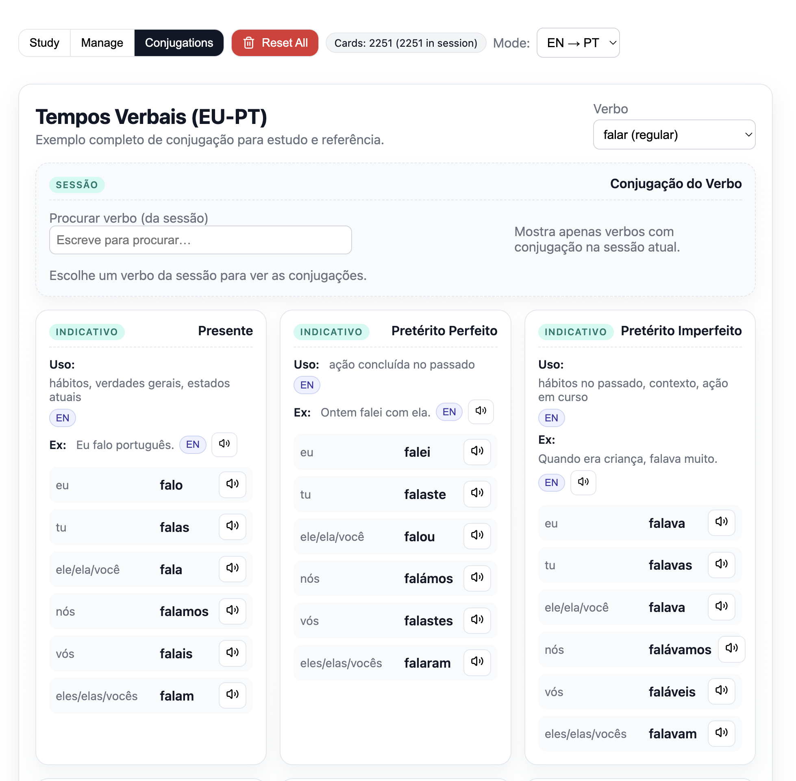

# Portuguese Flashcards App

A modern, lightweight flashcard application for learning European Portuguese, built with React, TypeScript, and Vite.

## Screenshots

### Study Mode


*Interactive flashcard study with audio pronunciation*

### Conjugations


*Full EU-PT conjugation guide with usage hints, examples, and audio*

### Manage Mode


*Card management with search, filter, and import/export*

## Features

- **Study Mode**: Interactive flashcard practice with EN↔PT translation support
- **Know It / Still Learning**: Mark cards as known to skip them in future sessions
- **Batch Study**: Study in fixed-size batches (10/20/30/50 cards) instead of the full pile — remembers your position
- **Audio Pronunciation**: Built-in text-to-speech for both English and Portuguese
- **Smart Session Management**: Persist study sessions and batch progress across browser refreshes
- **Card Management**: Add, search, filter, and organize flashcards
- **Rich Card Types**: Support for nouns, verbs (regular/irregular), adjectives, expressions, and more
- **Examples & Conjugations**: Store example sentences and verb conjugations
- **Sample Words**: Load 2,251 curated European Portuguese words with one click
- **Import/Export**: Import from CSV and export to CSV
- **Saved Study Sets**: Reuse named card selections for focused review
- **Pagination & Sorting**: Efficient table with TanStack Table
- **Local Storage**: All data stored locally in browser (no backend required)
- **Single-File Build**: Compiles to a single HTML file for easy distribution

## Tech Stack

- **React 19** - UI library
- **TypeScript** - Type safety
- **Vite 7** - Build tool & dev server
- **TanStack Table** - Table management
- **vite-plugin-singlefile** - Single HTML output

## Project Structure

```plaintext
src/
├── components/
│   ├── StudyMode.tsx       # Study interface with card flipping & rating
│   ├── ManageMode.tsx      # Card management, batches & import/export
│   ├── CardTable.tsx       # Sortable, paginated table
│   └── ConjugationGuide.tsx # Verb conjugation display
├── hooks/
│   ├── useFlashcards.ts    # Card CRUD operations
│   ├── useSession.ts       # Study session state
│   ├── useKnownCards.ts    # Known/learning card tracking
│   └── useStudyGroups.ts   # Saved study sets
├── utils/
│   ├── storage.ts          # localStorage helpers
│   ├── debounce.ts         # Performance optimization
│   └── speech.ts           # Text-to-speech audio
├── flashcard-types.ts      # TypeScript types
├── App.tsx                 # Main app component
├── main.tsx                # Entry point
└── index.css               # Global styles
```

## Getting Started

### Installation

```bash
npm install
```

### Development

```bash
npm run dev
```

Opens at `http://localhost:5173`

### Build

```bash
npm run build
```

Creates a single `dist/index.html` file (502KB gzipped to ~159KB)

### Preview Production Build

```bash
npm run preview
```

## Usage

### Loading Sample Words

The app includes 2,251 curated European Portuguese words with examples and verb conjugations:

1. Click **Manage** tab
2. Click **Load Sample Words** button
3. Confirm to add all words to your collection

This instantly loads essential vocabulary including:
- Common verbs (regular/irregular) with full conjugations
- Everyday nouns, adjectives, and adverbs
- Food, travel, technology, and business terms
- European Portuguese specific vocabulary

### Adding Cards

1. Click **Manage** tab
2. Fill in English & Portuguese (EU) translations
3. Select word type (noun, verb, etc.)
4. Optionally add examples: `English sentence | Portuguese sentence`
5. Click **Add**

### Studying

1. Go to **Manage** tab
2. Pick a batch size (10, 20, 30, or 50) and navigate to the batch you want
3. Click **Start batch** (known cards are skipped by default)
4. Click **Study** tab
5. Click cards to flip between languages
6. After flipping, mark **Know it** or **Still learning**
7. Toggle **EN → PT** or **PT → EN** mode

Your batch position is saved automatically — come back anytime and pick up where you left off.

### Import / Export

#### CSV Import

The app supports importing cards from a CSV file.

**Format (one card per line):**

```csv
english,portuguese,type,example_en,example_pt,present,past_perfeito,past_imperfeito,future
```

Conjugation columns are optional. Each conjugation column has 6 forms separated by `|` (eu, tu, ele/ela/voce, nos, vos, eles/elas/voces).

### Search & Filter

- Search by English/Portuguese text or examples
- Filter by word type (noun, verb, adjective, etc.)
- Show only selected cards

## Performance Optimizations

- **Debounced Saves**: localStorage writes batched to reduce I/O (500ms)
- **Memoized Filtering**: Efficient search/filter with React.useMemo
- **Code Splitting**: Components separated for better tree-shaking
- **Single File Build**: No network requests after initial load

## Data Storage

All data stored in `localStorage`:

| Key | Purpose |
|-----|---------|
| `flashcards-min-v1` | Card collection |
| `flashcards-session-v1` | Active study session |
| `flashcards-selected-v1` | Selected card IDs |
| `flashcards-progress-v1` | Current card index in session |
| `flashcards-known-v1` | Cards marked as known |
| `flashcards-batch-v1` | Batch size and position |
| `flashcards-groups-v1` | Saved study sets |
| `flashcards-page-size` | Table pagination preference |

## Card Schema

```typescript
interface Card {
  id: string;
  front: string;                    // English
  back: string;                     // Portuguese (EU)
  type?: WordType;                  // noun, verb-regular, etc.
  examples?: ExamplePair[];         // Bilingual examples
  conjugations?: Conjugations;      // Optional verb conjugations (present / past / future)
  createdAt?: number;               // Timestamp
}
```

## Browser Support

Modern browsers with ES2020+ support:

- Chrome/Edge 80+
- Firefox 75+
- Safari 13.1+

## Audio Pronunciation

Uses the Web Speech API for text-to-speech:

- Free and built into browsers
- Works offline after initial page load
- Supports European Portuguese (pt-PT) and English (en-US)

## Development

### Type Checking

```bash
npx tsc --noEmit
```

### Linting

```bash
npm run lint
```

Made with ❤️ for Portuguese learners
